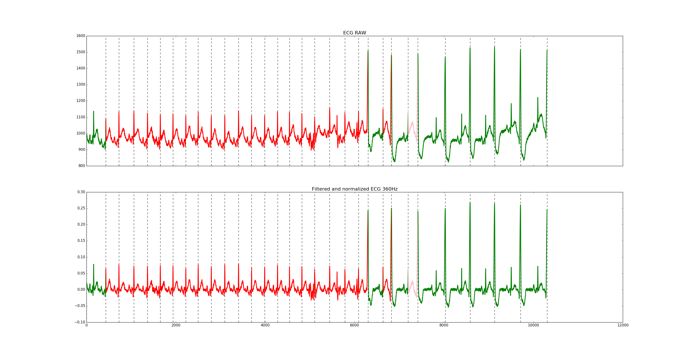

# ECG prediction module

Given an ML-II (derivation II) ECG signal, this module detects its R-peaks and return a prediction for each beat.

The classes used in this module follow the standard **AAMI-Recomendations**:
 
| Class |  N| SVEB| VEB | F | Q |
|--|--|--|--|--|-----|
|id| 0| 1|2|3|4|

**N**: Normal

**SVEB**: Supraventricular

**VEB**: Ventricular Ectopic Beat 

**F**: Fusion

**Q**: unknown beat

# Python implementation

## Example of use:

Go to python subdir and run:
```
python example.py ../data/220.csv
```

The file *example.py* show a complete example of classification
of ECG signals (corresponding to ML-II).

First of all we need to load the data:
```python
ecg_signal, fs, min_A, max_A, n_bits = load_signal(sys.argv[1])
```

Later a QRS detector is applied on the signal:

```python
qrs_detector = QRSDetectorOffline(ecg_data_raw = ecg_signal, fs = fs, verbose=False, plot_data=False, show_plot=False)
```

The method QRSDetectorOffline detects the R-peaks of the input ECG signal (ML-II). If the signal is not sampled at 360Hz the function will resample the data:

- qrs_detector.ecg_data_raw             signal at original sampling frecuency

- qrs_detector.ecg_data                 signal resampled at 360Hz

- qrs_detector.qrs_peaks_indices        contains R peaks at 360 Hz sampling frequency

- qrs_detector.qrs_peaks_indices_fs     contains R peaks at original sampling frequency


Finally several features are computed for each beat an a prediction is given by the SVM models trained:

```python
qrs_classifier = QRSClassifier(svm_models_path = '../svm_models', ecg_data = qrs_detector.ecg_data, qrs_peaks_indices = qrs_detector.qrs_peaks_indices, min_A = min_A, max_A = max_A) 
```

The predictions is stored as intergers in the range [0, 4] at *qrs_classifier.predictions* following the class naming of the AAMI-Recomendations: 

-**N**(0): Normal  

-**SVEB**(1): Supraventricular

-**VEB**(2): Ventricular Ectopic Beat 

-**F**(3): Fusion

-**Q**(4): unknown beat


Additionally this example display a plot that contains:

- The RAW ECG signal (top) and the normalized
- filtered and sampled at 360Hz ECG signal (bottom). 

Both subplots contains the R-peaks (vertical lines) and each beat is represented with a color based on the SVM prediction: *(N, Green) (SVEB, Red) (VEB, Pink) (F, Yellow) (Q, Blue)*


Plot from 220 record:




## Requirements:

*NOTE: these requirements are only informative since the files required for these libraries have been already included in the project*

### LibSVM
To use the trained SVM models and predict the result for new incoming data

Download from: https://www.csie.ntu.edu.tw/~cjlin/libsvm/

Installation:
Type 'make clean' on dir: 3rdparty/libsvm-3.22
and then type 'make' on dir 3rdparty/libsvm-3.22/python to generate the file 'libsvm.so.2'

### Python libraries

#### Matplotlib
https://matplotlib.org/

#### SciPy
https://www.scipy.org/

## Files

### QRS_detector.py

### QRS_classifier.py

### example.py

# [C++ implementation](src/README.md)
Early version developed in C++.