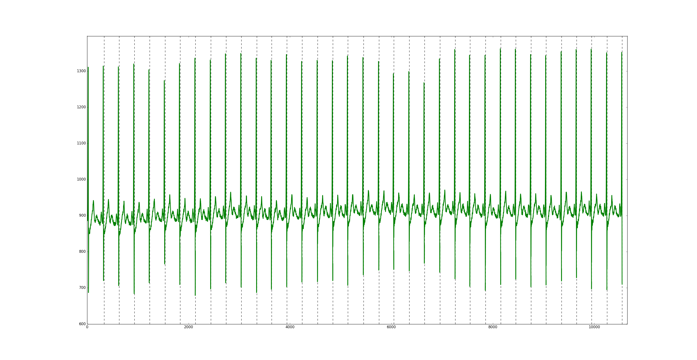
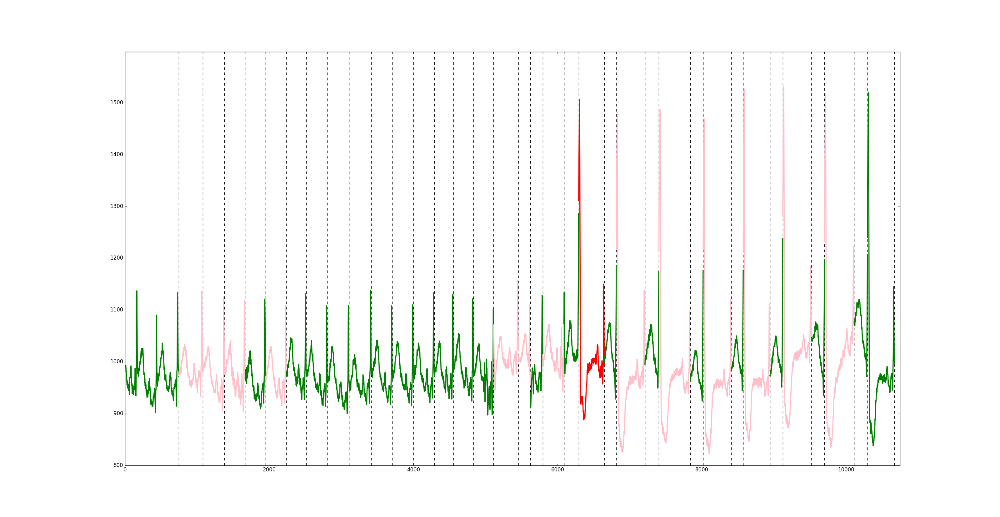

# Show Results

Given the original signal and the file output generated from module: *ecg_prediction_module* this code display a **plot** that remark: 

1.	Each R-peaks (vertical lines) 
2. Show a different color depending on the class predicted for each beat:
	
		N	0	(Green) 
 		SVEB	1 	(Red)
 		VEB	2	(Pink)
		F 	3	(Yellow)
		Q	4	(Blue)

# Example of use

```
python show_results ../data/220.csv ../data/220.csv.out
```

Plot from 220 record:




Plot from 228 record:




## Requirements

Python 2.7, 3.0

Matplotlib: https://matplotlib.org/api/pyplot_api.html